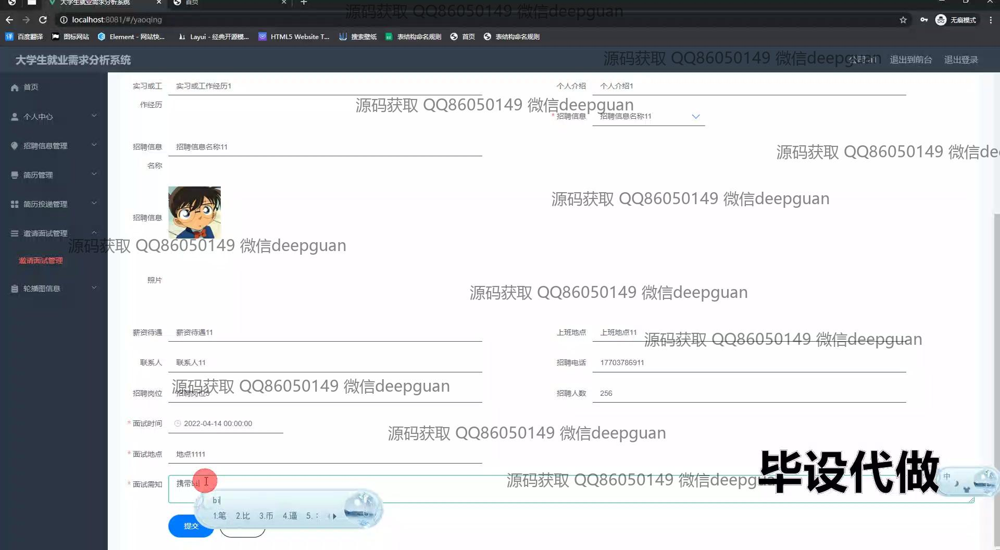

<h1 align="center">大学生就业需求分析系统</h1>

## 简介
大学生就业需求分析系统：基于Spring Boot开发，包括招聘信息管理、简历管理、数据可视化、就业趋势分析功能，支持用户角色的注册与登录，为大学生提供科学的就业指导和决策支持。    --计算机毕业设计源码；毕设源码；java毕业设计源码

## 联系方式

<h3 align="center">获取完整代码与数据库文件 + 微信：deepguan QQ: 86050149 QQ群: 783742310</h3>

<h3 align="center">可帮忙远程部署 包运行成功！提供远程部署、修改代码、设计文档指导、代码讲解等服务！</h3>

## 功能介绍（完整见运行截图）
管理员：管理员通过本系统可以进行用户注册与登录管理、招聘岗位管理、院系类别管理、公司信息管理等功能。系统提供数据可视化功能，通过生成图表及分析报告，帮助管理员了解和决策当前就业市场趋势和大学生需求。管理员还可以查看统计信息并获取就业需求的详细数据，为系统用户提供及时的就业指导和支持。

公司：公司在系统中可发布招聘信息，管理招聘岗位，查看投递简历，并通过平台与学生进行直接联系。公司可以参与院校招聘会信息协作，通过平台获得对口毕业生的有效简历。系统为公司提供符合其需求的求职者信息，方便进行简历筛选和岗位需求分析。

学生：学生作为系统的主要用户群体，可以通过平台进行注册和登录，浏览和投递招聘信息。学生可填写详细的简历信息，包括教育经历、实习经历、求职意向等，通过系统获取个性化的就业建议与趋势分析报告。系统支持学生实时查看就业动态，简化求职流程并提高就业成功率。

访客：访客可以通过系统的公开信息部分了解当前就业市场的趋势和大学生的就业需求，参观公司的招聘信息与招聘动态。虽然访客不能与系统进行直接交互操作，但也能通过系统的信息展示了解就业市场趋势和行业分布情况，为后续加入系统做好准备。

## 运行截图

本代码来源于网络,仅供学习参考使用!

